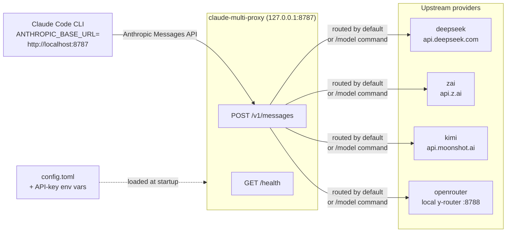
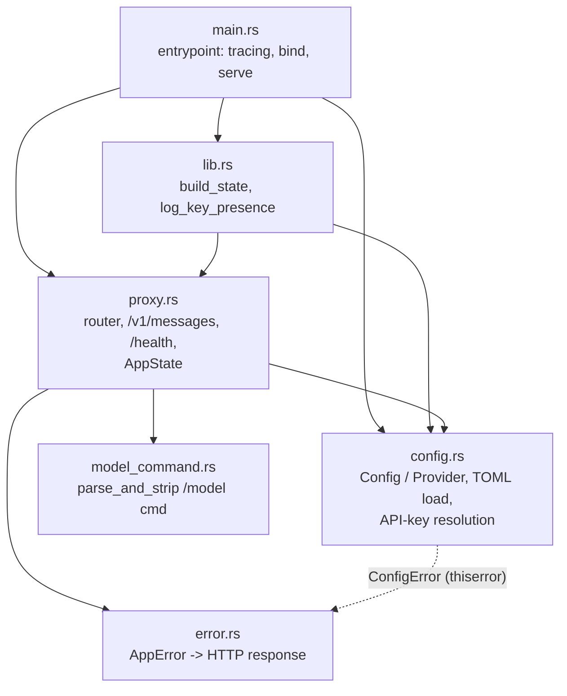
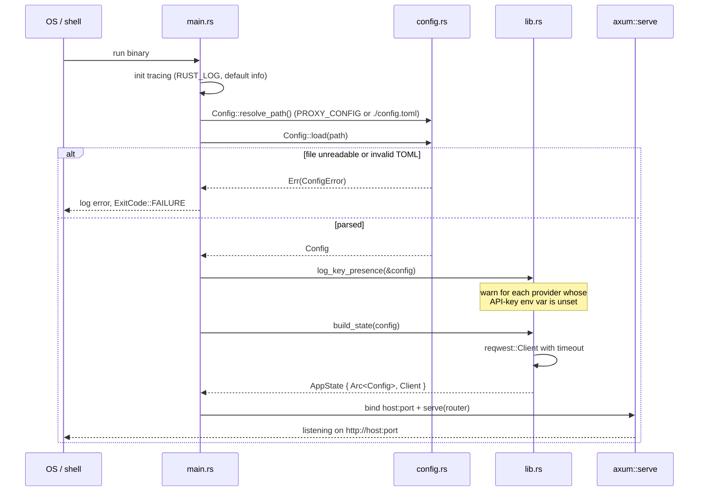
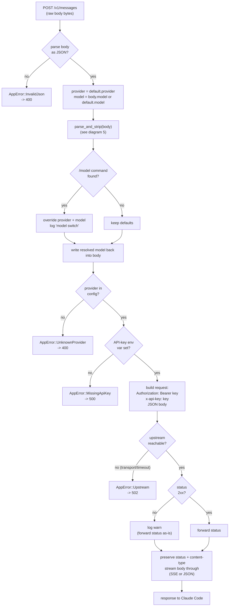
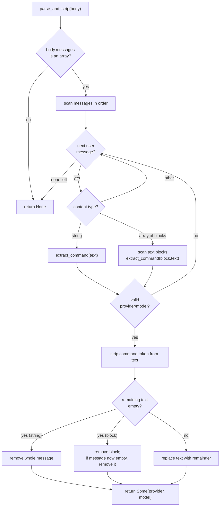
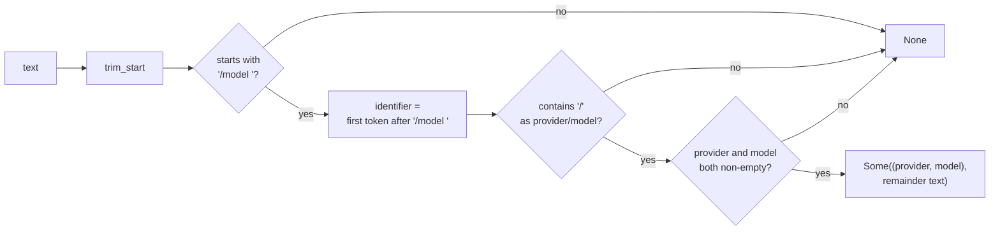
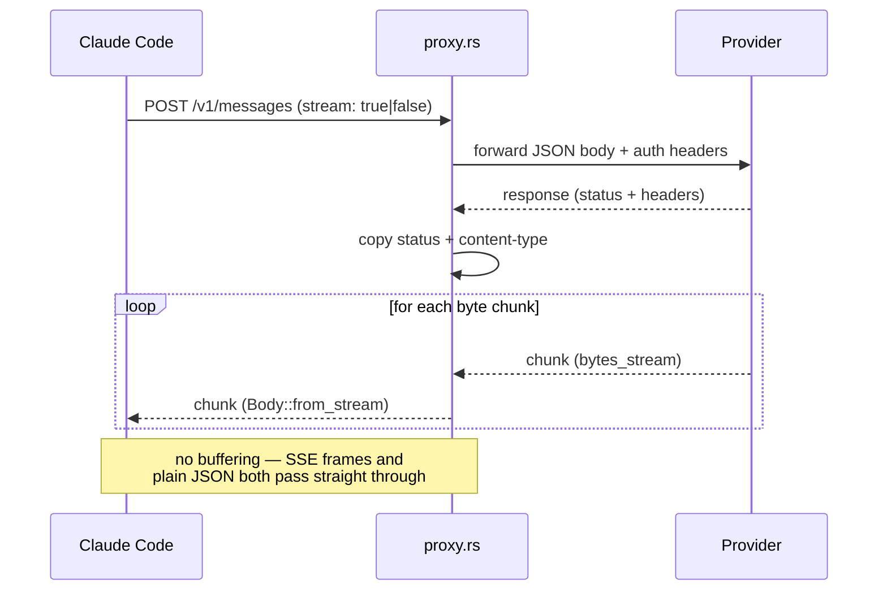
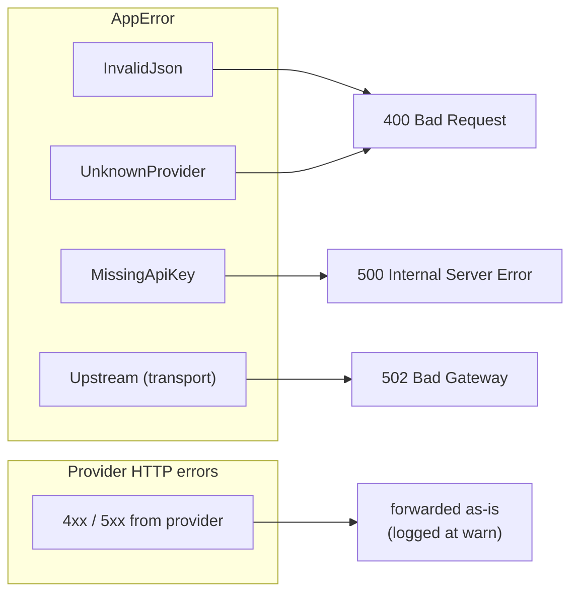

# Architecture

Documentation and process-flow diagrams for `claude-multi-proxy`, a local
reverse proxy that routes [Claude Code](https://claude.com/claude-code) requests
to multiple LLM providers with in-session `/model` switching.

All diagrams are [Mermaid](https://mermaid.js.org/) and render on GitHub, in
VS Code (with a Mermaid extension), and anywhere Mermaid is supported.

---

## 1. System context

Where the proxy sits between Claude Code and the upstream providers.

---

## 2. Module layout

How the crate is decomposed. `lib.rs` wires shared state; `main.rs` is the thin
binary entrypoint.

---

## 3. Startup sequence

What happens from process launch to a listening server.

---

## 4. Request processing flow — `POST /v1/messages`

The core routing and forwarding logic, including every error branch.

---

## 5. `/model` command parsing — `parse_and_strip`

Detects `/model <provider>/<model>` in the first user message, reroutes, and
strips the command from the text. Handles both string content and the
array-of-content-blocks shape Claude Code emits.

### `extract_command` recognition rules

---

## 6. Response streaming

Both streaming (SSE) and non-streaming responses take the same unbuffered path —
the proxy never parses or re-serializes the provider's body.

---

## 7. Error mapping

Every `AppError` variant maps to one HTTP status and a JSON `{"error": ...}` body.
Upstream *HTTP* errors (4xx/5xx from the provider) are distinct: they are
forwarded through with the provider's real status, not remapped.

---

## Related documents

- [README.md](../README.md) — usage and setup
- [Design spec](superpowers/specs/2026-07-10-claude-multi-proxy-rust-design.md) — original design decisions
